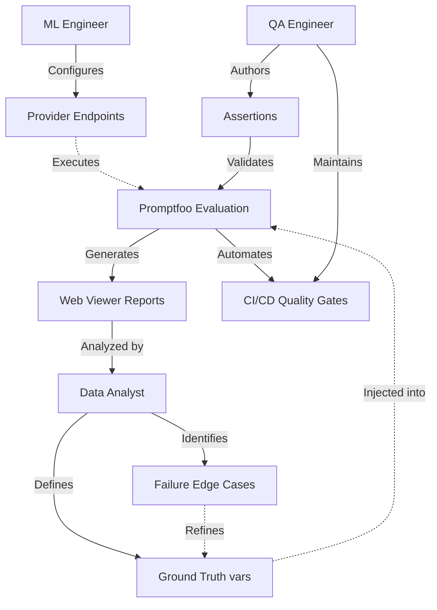

# Promptfoo Learning Guide

Welcome to the Promptfoo learning project! This repository contains a working configuration to help you learn Promptfoo basics, utilizing Ollama free models and Python integration for NLP task evaluation.

## What is Promptfoo?
Promptfoo is a CLI and library for evaluating LLM output quality. It allows you to systematically test prompts and models against predefined test cases, ensuring that your LLM applications behave reliably as you change prompts, models, or system parameters.

## Core Concepts to Know

1. **Providers**: The LLM APIs or models you are evaluating (e.g., Ollama models like llama3, Anthropic, OpenAI).
2. **Prompts**: The instructions sent to the LLM, managed in separate files (e.g., `prompts.txt`) with variables injected via placeholders (`{{topic}}`).
3. **Tests**: Evaluating specific scenarios using `vars` (ground truth data) and `assert` statements (validation rules).

### Assertion Hierarchy (Types of Tests)

Promptfoo evaluates LLM outputs using an assertion hierarchy categorized by cost, complexity, and specific testing goals. Understanding these types ensures efficient and robust test pipeline execution.

| Test Type | Cost | Mechanisms | Primary Use Cases |
| :--- | :--- | :--- | :--- |
| **Deterministic** | \$0 | Regex, exact string matching (`equals`, `contains`), JSON schema validation. | Strict output formatting, JSON payload validation, and ensuring expected keywords exist. |
| **Heuristic** | \$0 | Latency ceilings, token limit thresholds, cost constraints. | Catching performance regressions, enforcing scaling limits, and preventing excessive LLM verbosity. |
| **Semantic** | Low | Vector embedding distance (`similar`). | Verifying the contextual meaning of an LLM's output against the ground truth, effectively ignoring phrasing or syntactic differences. |
| **LLM-as-a-Judge** | High | `llm-rubric`, `factuality`, `model-graded-closedqa`. | Evaluating subjective criteria using a superior reference model (e.g., testing tone compliance, empathetic responses, or detecting hallucinations). |
| **Custom Code** | Variable | Python or JavaScript functions (`python`, `javascript`). | Executing complex business logic (e.g., testing an LLM-generated SQL query against a sandbox database, or executing custom local validation scripts). |

### Division of Labor (Role Interaction)

Effective, enterprise-grade LLM testing deployments demand a clear separation of concerns across engineering and data teams when leveraging Promptfoo.

| Role | Operational Scope & Workflow |
| :--- | :--- |
| **Data Analysts / Domain Experts** | Own the test datasets (`vars`) and define the "ground truth." Leverage the Promptfoo web viewer to browse reports, analyze model responses, and identify failure edge cases. |
| **QA Engineers** | Own the assertions (`assert`) and CI/CD pipelines. Translate complex business rules into automated, blocking test cases designed to prevent regressions from reaching production environments. |
| **ML Engineers** | Own the provider configuration (e.g., Vertex AI endpoints, routing rules). Optimize model hyperparameters, manage prompt versioning, and maintain the underlying LLM inference infrastructure. |

### Process Logic & Role Workflow



## Setup & Dependencies

1. **Install Ollama:**
   ```bash
   # Download from https://ollama.ai and install
   # Pull models, e.g.:
   ollama pull llama3
   ```

2. **Install Python dependencies:**
   ```bash
   pip install -r requirements.txt
   ```

3. **Install Promptfoo:**
   ```bash
   npm install -g promptfoo
   ```

## How to Run the Project

1. **Activate your Python environment** (optional but recommended):
   ```bash
   python -m venv .venv
   # Windows
   .venv\Scripts\Activate.ps1
   # macOS / Linux
   source .venv/bin/activate
   ```

2. **Install dependencies** if not already installed:
   ```bash
   pip install -r requirements.txt
   ```

3. **Start the backend API**:
   ```bash
   uvicorn backend.app:app --reload --host 127.0.0.1 --port 8000
   ```
   The FastAPI server will be available at `http://127.0.0.1:8000`.

4. **Run the Promptfoo evaluation** in a separate terminal:
   ```bash
   npx promptfoo eval
   ```
   This evaluates the configured prompts and providers, then prints a pass/fail summary.

5. **View results** in the Promptfoo web dashboard:
   ```bash
   npx promptfoo view
   ```

6. **Run tests**:
   ```bash
   pytest tests/unit tests/functional
   ```

## Dataset Configurations

The project includes YAML configuration files for various NLP tasks, defining dataset setups for evaluation:

- `imdb_sentiment.yaml`: Sentiment analysis on IMDB movie reviews.
- `amazon_reviews.yaml`: Text classification for Amazon product reviews.
- `cornell_dialog.yaml`: Conversational dialogue generation using Cornell Movie Dialog Corpus.
- `wikipedia_ner.yaml`: Named Entity Recognition (NER) for Wikipedia articles.

Each config specifies the dataset name, task, input/output columns for structured evaluation.

## Project Structure
- `promptfooconfig.yaml`: The main configuration file tying everything together (specifies providers, prompts, and the test cases).
- `sentiment_prompt.txt`: Prompt for sentiment analysis tasks.
- `classification_prompt.txt`: Prompt for text classification tasks.
- `dialogue_prompt.txt`: Prompt for dialogue generation tasks.
- `ner_prompt.txt`: Prompt for named entity recognition tasks.
- `custom_eval.py`: A Python script containing custom assertion logic for accuracy calculation against dataset.
- `backend/app.py`: FastAPI backend providing NLP task endpoints.
- `backend/api.py`: Convenience alias exposing the same FastAPI application.
- `custom_provider.py`: Custom Promptfoo provider that calls the API.
- `dataset.json`: Sample dataset with Q&A pairs for ground truth comparisons.
- `imdb_sentiment.yaml`: Dataset configuration for IMDB sentiment analysis.
- `amazon_reviews.yaml`: Dataset configuration for Amazon product reviews classification.
- `cornell_dialog.yaml`: Dataset configuration for Cornell movie dialog generation.
- `wikipedia_ner.yaml`: Dataset configuration for Wikipedia NER.
- `requirements.txt`: Python dependencies (FastAPI, etc.).
- `result.json`: Output of the latest evaluation run.

## Running Evaluations

To run your tests as configured in `promptfooconfig.yaml`:

```bash
npx promptfoo eval
```
This runs all test cases against the configured providers and outputs a pass/fail summary matrix in your terminal.

## Viewing Results

To see a detailed, interactive web dashboard with your evaluation results, side-by-side prompt comparisons, and assertion reasoning:

```bash
npx promptfoo view
```
