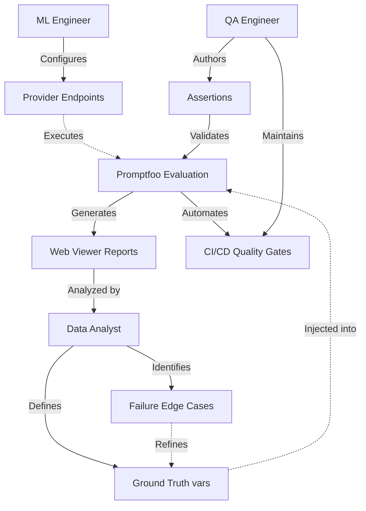

# Promptfoo Learning Guide

Welcome to the Promptfoo learning project! This repository contains a working configuration to help you learn Promptfoo basics, utilizing Google Vertex AI and Python integration.

## What is Promptfoo?
Promptfoo is a CLI and library for evaluating LLM output quality. It allows you to systematically test prompts and models against predefined test cases, ensuring that your LLM applications behave reliably as you change prompts, models, or system parameters.

## Core Concepts to Know

1. **Providers**: The LLM APIs or models you are evaluating (e.g., Google Vertex AI, Anthropic, OpenAI).
2. **Prompts**: The instructions sent to the LLM, managed in separate files (e.g., `prompts.txt`) with variables injected via placeholders (`{{topic}}`).
3. **Tests**: Evaluating specific scenarios using `vars` (ground truth data) and `assert` statements (validation rules).

### Assertion Hierarchy (Types of Tests)

Promptfoo evaluates LLM outputs using an assertion hierarchy categorized by cost, complexity, and specific testing goals. Understanding these types ensures efficient and robust test pipeline execution.

| Test Type | Cost | Mechanisms | Primary Use Cases |
| :--- | :--- | :--- | :--- |
| **Deterministic** | \$0 | Regex, exact string matching (`equals`, `contains`), JSON schema validation. | Strict output formatting, JSON payload validation, and ensuring expected keywords exist. |
| **Heuristic** | \$0 | Latency ceilings, token limit thresholds, cost constraints. | Catching performance regressions, enforcing scaling limits, and preventing excessive LLM verbosity. |
| **Semantic** | Low | Vector embedding distance (`similar`). | Verifying the contextual meaning of an LLM's output against the ground truth, effectively ignoring phrasing or syntactic differences. |
| **LLM-as-a-Judge** | High | `llm-rubric`, `factuality`, `model-graded-closedqa`. | Evaluating subjective criteria using a superior reference model (e.g., testing tone compliance, empathetic responses, or detecting hallucinations). |
| **Custom Code** | Variable | Python or JavaScript functions (`python`, `javascript`). | Executing complex business logic (e.g., testing an LLM-generated SQL query against a sandbox database, or executing custom local validation scripts). |

### Division of Labor (Role Interaction)

Effective, enterprise-grade LLM testing deployments demand a clear separation of concerns across engineering and data teams when leveraging Promptfoo.

| Role | Operational Scope & Workflow |
| :--- | :--- |
| **Data Analysts / Domain Experts** | Own the test datasets (`vars`) and define the "ground truth." Leverage the Promptfoo web viewer to browse reports, analyze model responses, and identify failure edge cases. |
| **QA Engineers** | Own the assertions (`assert`) and CI/CD pipelines. Translate complex business rules into automated, blocking test cases designed to prevent regressions from reaching production environments. |
| **ML Engineers** | Own the provider configuration (e.g., Vertex AI endpoints, routing rules). Optimize model hyperparameters, manage prompt versioning, and maintain the underlying LLM inference infrastructure. |

### Process Logic & Role Workflow



## Setup & Dependencies

1. **Install Python dependencies:**
   ```bash
   pip install -r requirements.txt
   ```

2. **Authenticate with Google Cloud (for Vertex AI):**
   ```bash
   gcloud auth application-default login
   gcloud config set project YOUR_PROJECT_ID
   ```
   Or set the `GOOGLE_APPLICATION_CREDENTIALS` and `GCLOUD_PROJECT` environment variables.

3. **Install Promptfoo:**
   ```bash
   npm install -g promptfoo
   ```

## Project Structure
- `promptfooconfig.yaml`: The main configuration file tying everything together (specifies providers, prompts, and the test cases).
- `prompts.txt`: Contains the raw prompt template.
- `custom_eval.py`: A Python script containing custom assertion logic. During evaluations, Promptfoo executes this to validate the outputs programmatically based on your logic.

## Running Evaluations

To run your tests as configured in `promptfooconfig.yaml`:

```bash
npx promptfoo eval
```
This runs all test cases against the configured providers and outputs a pass/fail summary matrix in your terminal.

## Viewing Results

To see a detailed, interactive web dashboard with your evaluation results, side-by-side prompt comparisons, and assertion reasoning:

```bash
npx promptfoo view
```
